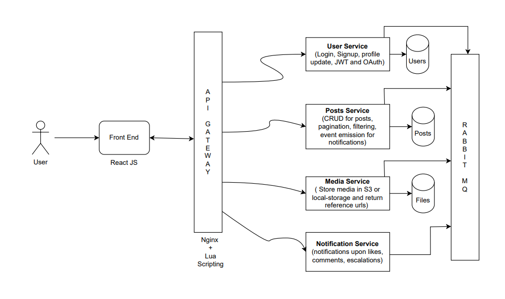

# 🏙️ UrbanPost

**UrbanPost** is an open-source, event-driven platform that empowers citizens to report and track local infrastructure issues — such as potholes, broken streetlights, and garbage dumps.  
It aims to improve **urban governance** by connecting citizens and authorities through a transparent, community-driven system.

---

## 🚀 Overview
UrbanPost is being rebuilt using a **microservices architecture** for scalability, modularity, and maintainability.  
Each service handles a specific responsibility (Users, Posts, Media, Notifications) and communicates asynchronously via **RabbitMQ**.

---

## 🧩 Core Features
- 📍 **Report Issues** — Create posts with location, description, and media attachments.  
- 🗂 **Browse & Filter** — Discover issues by location, category, or status.  
- 🔐 **User Authentication** — Secure signup, login, JWT-based auth, and OAuth integration.  
- 💬 **Community Engagement** — Commenting, upvoting, and issue tracking.  
- 🔔 **Notifications** — Event-driven alerts on likes, comments, and escalations.  
- 🧠 **Modular Design** — Separate microservices for users, posts, media, and notifications.  
- 🌍 **Modern Frontend** — React.js-based interface consuming the API Gateway.

---

## 🏗️ Architecture

```markdown



```
## Repository structure

urbanpost/
├── api_gateway/
├── services/
│   ├── user_service/
│   ├── posts_service/
│   ├── media_service/
│   └── notification_service/
├── shared/
│   ├── models/
│   └── utils/
├── docker-compose.yml
└── README.md

## Development Status

UrbanPost is actively under development and currently in the v1 phase, focusing on:
- Implementing base microservices
- Establishing inter-service communication (RabbitMQ)
- Building the API Gateway
- Admin/authority dashboards
- Real-time updates

## 🤝 Contributing

Contributions are welcome!
Feel free to fork the repo, open issues, or submit pull requests.
